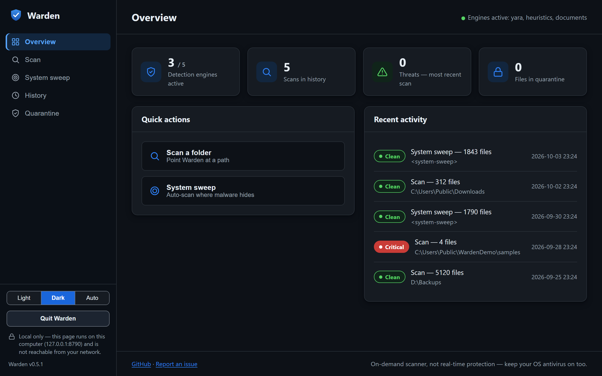
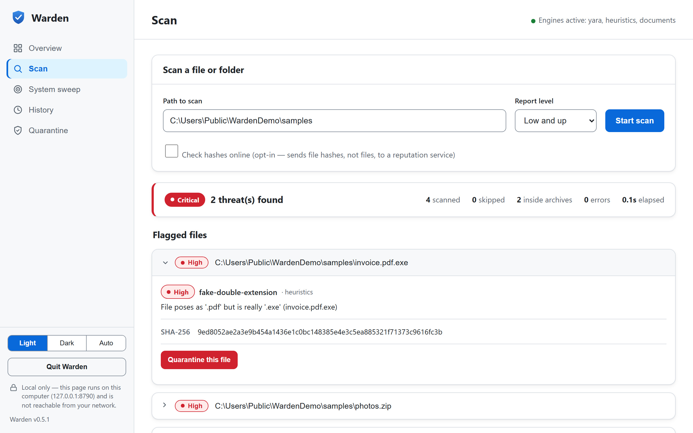

<div align="center">


### Open-source, on-demand malware scanner for Windows, Linux & macOS

No subscription. No telemetry. No lock-in.

[](https://github.com/ForrestLasiter/warden/actions/workflows/ci.yml)
[](https://github.com/ForrestLasiter/warden/actions/workflows/release.yml)
[](LICENSE)
[](https://www.python.org/)
[](https://github.com/ForrestLasiter/warden/releases)

[**Download**](#download) · [**Quickstart**](#quickstart) · [**Dashboard**](#dashboard) · [**How it works**](#how-it-works) · [**Docs**](#usage)

</div>

---

Warden scans a file, a folder, or your whole drive and tells you what looks
malicious — using [YARA](https://virustotal.github.io/yara/) rules, structural
heuristics, hash reputation, and (optionally) [ClamAV](https://www.clamav.net/).
It ships as a clean command-line tool **and** an accessible local web dashboard.

> **Warden is a second opinion you own.** It's an *on-demand* scanner, not a
> real-time resident antivirus, and it's **not a replacement for Microsoft
> Defender** (which is free and built into Windows — keep it on). Warden is for
> people who want to inspect their system with a transparent tool they control.

<div align="center">


</div>

## Download

Grab a standalone binary — **no Python required** — from the
[**Releases**](https://github.com/ForrestLasiter/warden/releases/latest) page, or
install with one line:

**Windows** (PowerShell):
```powershell
irm https://raw.githubusercontent.com/ForrestLasiter/warden/main/scripts/install.ps1 | iex
```

**Linux / macOS**:
```bash
curl -fsSL https://raw.githubusercontent.com/ForrestLasiter/warden/main/scripts/install.sh | sh
```

| Platform | File |
| --- | --- |
| Windows x64 | `warden-windows-x64.exe` |
| Linux x64 | `warden-linux-x64` |
| Linux ARM64 | `warden-linux-arm64` |
| macOS (Apple Silicon) | `warden-macos-arm64` |

On first run Windows SmartScreen may warn about an unsigned binary — Warden is
unsigned, and the source is right here for you to build yourself.

## Quickstart

```bash
warden gui                          # open the dashboard (easiest)
warden scan ~/Downloads             # scan a folder from the terminal
warden sweep                        # auto-scan where malware hides
```

## What it detects

Warden runs every file past up to four independent engines and reports the worst
verdict, rated **Info → Low → Medium → High → Critical**:

| Engine | What it does | Requires |
| --- | --- | --- |
| **YARA** | Rule-based pattern matching (VirusTotal's `yara-x`). Ships with starter rules; drop in community packs. | built in |
| **Heuristics** | Structural red flags: fake double extensions (`invoice.pdf.exe`), packed PE sections, risky imports, obfuscated scripts, high entropy. | built in |
| **Hash reputation** | SHA-256 against a local known-bad list, plus opt-in online lookups (see below). | built in |
| **ClamAV** | Millions of signatures via `clamscan`/`clamdscan`. | optional — install ClamAV |

## Dashboard

`warden gui` opens a local dashboard for scans, sweeps, history, and quarantine —
with live progress and one-click isolation. It targets **WCAG 2.1 AA**
(self-assessed): keyboard navigation, visible focus, ARIA roles and live regions,
`prefers-reduced-motion`, and a **light / dark / system** theme toggle. No
Electron, no dependencies beyond the Python standard library.

**Security:** the server binds to `127.0.0.1`, validates the `Host` header
(blocks DNS rebinding), requires a per-session token on every API call (blocks
cross-site requests), caps request size and concurrent jobs, and only quarantines
files it actually scanned. It is **not** hardened against other processes running
as you — see [Threat model & limitations](#threat-model--limitations). Stop it
when you're done.

## Usage

```bash
warden scan <path>                   # scan a file or folder
warden scan C:\ --min-severity high  # scan a whole drive, only loud findings
warden scan .\Downloads --quarantine # scan, then offer to isolate anything flagged
warden scan .\Downloads --json out.json --save   # machine-readable + saved to history
warden scan suspicious.exe --online  # also check hashes against online reputation

warden lookup suspicious.exe         # look up one file's reputation
warden lookup <sha256-or-sha1>       # ...or just a hash

warden sweep                         # scan autoruns, processes, tasks, Temp, Downloads
warden sweep --quick                 # faster: top-level temp/downloads + executables only

warden quarantine list               # see isolated files
warden quarantine restore <id>       # put one back
warden quarantine delete <id>        # permanently remove (asks first)

warden history list                  # past scans/sweeps
warden history show <id>             # threats from a saved report

warden schedule add nightly --kind sweep --frequency daily --at 03:00
warden schedule list
warden schedule remove nightly

warden status                        # which engines are active
warden config show                   # view settings (secrets masked)
warden config set-vt-key             # store a VirusTotal API key (hidden prompt)
warden config set online_hash_lookup true   # change any setting
warden update-rules                  # how to add YARA rules & hash feeds
```

`warden scan` / `warden sweep` exit **1** when any Medium+ threat is found and
**0** when clean — handy for scripts and scheduled runs.

## How it works

Files that fit within `max_scan_bytes` (100 MB by default) are read **once** and
hashed from that same buffer, so the recorded SHA-256 always matches the bytes
that were scanned. Larger files are hashed in full while content engines see the
first `max_scan_bytes`. Findings are aggregated into a per-file verdict and a
per-scan report. The same core powers the CLI, the sweep, the scheduler, and the
dashboard.

- **On-demand, not resident.** No kernel driver, no background hooks. Warden runs
  when you ask it to — real-time protection is what Defender already does well.
- **Fails safe, not open.** If a detection engine errors on a file — or a whole
  engine fails to load (e.g. a broken YARA ruleset) — the result is reported
  **`unknown`**/degraded, never `clean`, and the scan exits non-zero (2). A
  crashed or missing engine can't turn into a false "all clear."
- **Reversible quarantine.** Quarantine never runs a file and never hard-deletes
  without explicit confirmation. It hashes the file **as it copies it** and
  aborts unless those bytes match the scan, writes the neutralized copy durably
  (fsync) and removes the original **last**, so a crash can't lose your file and
  the stored copy provably matches what was detected. Restore refuses to
  overwrite an existing file or follow a symlink. The stored `.qbin` is
  XOR-obfuscated to prevent *accidental* execution / AV re-detection — that's
  obfuscation, not encryption.
- **Careful with external tools.** System utilities Warden shells out to
  (PowerShell for signature checks, `schtasks`) are invoked by **absolute path**,
  so a binary planted in the current directory can't hijack them.
- **Local-first.** Nothing leaves your machine unless you opt into online
  reputation (off by default). When enabled, only a file **hash** is sent — the
  keyless provider resolves it through Cloudflare's DNS-over-HTTPS to the Team
  Cymru registry, so that resolver sees the hash queries; VirusTotal (with your
  key) sees them directly. See [Online reputation](#online-reputation-opt-in).

## Threat model & limitations

Warden is an **on-demand second-opinion scanner**, not a real-time antivirus, and
not a sandbox. Specifically:

- **Keep your OS antivirus on.** Warden does not replace Microsoft Defender.
- **Missed detections and false positives are expected** in any scanner; treat
  results as advisory. `unknown` means an engine couldn't finish — investigate,
  don't assume clean.
- **The local dashboard shares the loopback trust domain.** The per-session token
  stops cross-site (CSRF) requests, and a `Host`-header check blocks DNS
  rebinding, but any process already running as you on your machine can reach
  `127.0.0.1` — the token is not a defense against local malware. Run the
  dashboard only on a machine you trust, and stop it when you're done.
- **Quarantine is containment against *accidents*, not against running malware.**
  The `.qbin` is trivially reversible by design (so you can restore).

## Online reputation (opt-in)

Warden can ask an online service whether a file is known malware. This is **off
by default**; enable it per run with `--online`, or in `~/.warden/config.json`
(`"online_hash_lookup": true`). It sends the file's **hash** — never the file
itself — and results are cached in `~/.warden/cache/`.

Two providers, chosen automatically:

- **Team Cymru Malware Hash Registry** (default, **no API key**) — returns an AV
  detection percentage for known-bad files over DNS-over-HTTPS. Works out of the box.
- **VirusTotal** (optional, richer — aggregates 70+ engines) — get a **free** API
  key at [virustotal.com](https://www.virustotal.com/) (Sign up → API key), then
  store it with a hidden prompt (keeps it out of shell history):

  ```bash
  warden config set-vt-key            # prompts for the key, enables online lookups
  ```

  The free tier is rate-limited, so Warden caps and caches lookups. You can also
  set `WARDEN_VT_API_KEY` in your environment instead.

```bash
warden lookup C:\path\to\file.exe    # check a file
warden lookup <sha256-or-sha1>       # ...or a bare hash
warden scan .\Downloads --online     # enrich a scan with reputation
```

> **Privacy:** a hash is a one-way fingerprint, not your file's contents, but it
> still leaves your machine when you opt in. Leave it off if you'd rather stay
> fully offline — every other engine works without a network.

## Adding detection content

Drop files into `~/.warden/rules/` (`C:\Users\<you>\.warden\rules\` on Windows):

- `*.yar` / `*.yara` — extra YARA rules. Great sources:
  [Neo23x0/signature-base](https://github.com/Neo23x0/signature-base),
  [Yara-Rules/rules](https://github.com/Yara-Rules/rules).
- `malware_hashes.txt` — one SHA-256 per line (`hash  optional-label`). Export
  from [MalwareBazaar](https://bazaar.abuse.ch/).

Rule severity comes from a `severity` metadata field on each rule
(`"low"`–`"critical"`). For the full ClamAV signature set, install ClamAV, run
`freshclam`, and Warden picks it up automatically.

## Testing it works (safely)

Use the [EICAR test file](https://www.eicar.org/download-anti-malware-testfile/) —
a harmless, industry-standard string every scanner flags. Warden ships a YARA
rule for it.

> ⚠️ Windows Defender deletes an EICAR file the instant it's written to disk. To
> test on-disk detection, create it in a Defender-excluded folder, or trust the
> bundled unit test which checks the pattern in memory.

## Install (dev)

```bash
git clone https://github.com/ForrestLasiter/warden
cd warden
python -m venv .venv
# Windows:  .venv\Scripts\activate
# Unix:     source .venv/bin/activate
pip install -e ".[dev]"
pytest -q
```

Build a standalone binary yourself:

```bash
pip install pyinstaller
pyinstaller packaging/warden.spec --noconfirm   # -> dist/warden(.exe)
```

## Roadmap

- [x] On-demand file/folder scan (YARA + heuristics + hash + ClamAV)
- [x] Safe, reversible quarantine
- [x] System sweep (autoruns, processes, scheduled tasks, Temp, Downloads)
- [x] Scheduled scans with saved history
- [x] Accessible web dashboard (WCAG 2.1 AA, light/dark)
- [x] Standalone Windows/Linux/macOS binaries on the Releases page
- [x] Opt-in online hash reputation lookup (Team Cymru — keyless; VirusTotal — free key)
- [x] ARM64 Linux builds

## Contributing

Issues and PRs are welcome — see [CONTRIBUTING.md](CONTRIBUTING.md). New YARA
rules under `warden/rules/` are especially valuable. Please read the
[Code of Conduct](CODE_OF_CONDUCT.md) and report security issues per our
[Security policy](SECURITY.md).

## License

[MIT](LICENSE). Warden bundles no third-party signatures; ClamAV and any rule
packs you add carry their own licenses.
